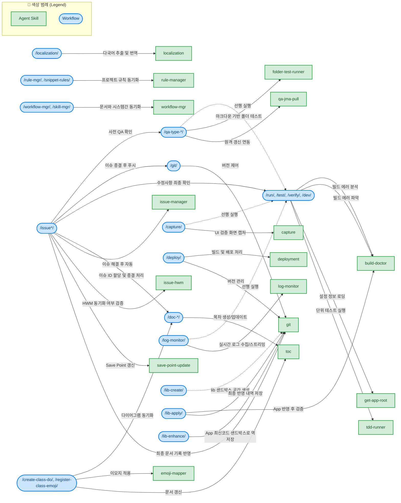

# fQRGen Agent System

이 문서는 fQRGen 프로젝트에서 AI 에이전트가 활용하는 Skills, Workflows, Rules을 정의하고 그 관계를 설명합니다.

## 1. 개요
* **Skills**: 에이전트가 단일 목적으로 수행할 수 있는 구체적인 기능 단위 (빌드 분석, 화면 캡처, 이슈 처리 등)
* **Workflows**: 여러 스킬과 규칙을 조합하여 특정 태스크(QA, 배포, 설계 동기화 등)를 한 번에 달성하는 자동화 파이프라인
* **Rules**: 에이전트가 작업을 수행할 때 반드시 지켜야 할 제약 사항 및 프로토콜 가이드

---

## 2. Skills와 Workflows 의존성 및 이용 관계 그래프

## 3. 구성 요소 및 역할

### 3.1. Skills
| Skill명 | 역할 |
| --- | --- |
| `build-doctor` | 빌드 에러 발생 시 로그를 분석하고 해결책을 제시합니다. |
| `capture` | UI 검증을 위해 애플리케이션의 특정 화면을 캡처하고 저장합니다. |
| `deployment` | 버전을 올리고, 빌드 후 `/Applications`에 배포하며, 배포 기록을 남깁니다. |
| `emoji-mapper` | CSV 매핑 파일을 기반으로 파일 내용에 이모지를 자동으로 적용합니다. |
| `folder-test-runner` | Markdown 기반 폴더 테스트를 실행하여 파일 변경 감지 및 규칙을 검증합니다. |
| `get-app-root` | fQRGen의 `appRootPath`를 설정 파일(plist)에서 읽어옵니다. |
| `git` | Git 작업(status, add, commit, push) 및 Save Point 검증을 수행합니다. |
| `issue-hwm` | 이슈 파일의 HWM(High Water Mark)을 검사하고 실제 데이터와 동기화(Self-Healing)합니다. |
| `issue-manager` | 이슈 등록, ID 생성, 이동 및 종결 처리를 자동화합니다. |
| `localization` | 다국어 지원(Localization) 작업(문자열 추출, 번역)을 수행합니다. |
| `log-monitor` | 실시간 키 입력 및 앱 로그 모니터링 환경을 구성합니다. |
| `rule-manager` | 프로젝트 규칙(`.agent/rules`)을 관리, 등록, 동기화하는 스킬입니다. |
| `save-point-update` | `Issue.md`의 Save Point 섹션을 업데이트합니다. |
| `tdd-runner` | 전용 러너 스크립트를 사용하여 fQRGen 프로젝트의 Swift 단위 테스트를 실행합니다. |
| `toc` | 마크다운 파일의 목차(TOC)를 자동으로 생성하고 업데이트합니다. |
| `workflow-mgr` | 워크플로우 문서(`.md`)와 시스템 문서 간의 동기화를 자동화합니다. |
| `qa-jma-pull` | 원격 jma 서버에 접속하여 fQRGen 코드를 최신화(git pull)합니다. |

### 3.2. Workflows
| Workflow명 | 역할 | 주요 활용 도구/Skill |
| --- | --- | --- |
| `/capture` | 설정창 UI 캡처 스크린샷 획득 및 검증 | `capture` |
| `/create-class-do` | 새로운 클래스 생성(분석, 이모지 발급, 문서화)의 표준 절차 | `emoji-mapper`, `toc` |
| `/deploy` | 디버그 빌드를 앱 애플리케이션에 배포, 버전 관리, 앱 교체 수행 | `deployment`, `git` |
| `/dev` | 프로젝트 코드 분석, 인수 지원 및 전체 개발 주기 통합 환경 구축 | `build-doctor`, `tdd-runner` |
| `/doc-design` | 코드 분석으로 디자인 설계(design) 문서 추출 및 업데이트 | `toc` |
| `/doc-work` | 코드 분석으로 작업 가이드(work) 문서 추출 및 업데이트 | `toc` |
| `/git` | 버전 관리 상태 확인(status), 커밋(commit), 푸시(push) 일괄 제어 | `git` |
| `/issue*` | 분석, 등록, 수정, 테스트, 종결까지 이어지는 티켓 관리 자동화 | `issue-manager`, `issue-hwm`, `save-point-update`, `git` |
| `/localization` | 다국어 문자열 추출, 번역 자동화 수행 및 파일화 | `localization` |
| `/lib-create` | 기능 추가 전 샌드박스 라이브러리(lib) 공간 및 기본 템플릿 생성 절차 | `git` |
| `/lib-apply` | `lib` 폴더에서 검증된 라이브러리/코드를 앱 실제 모듈 파일에 이식 및 적용 | `git`, `build-doctor` |
| `/lib-enhance` | 앱 모듈 코드(Xcode)를 다시 `lib` 폴더로 가져와 샌드박스 코드를 최신화 | `git` |
| `/log-monitor` | 키보드 훅 이벤트, 스니펫 등 실시간 앱 로그 모니터링 시작 | `log-monitor` |
| `/manual` | 빌드 시 Pandoc 등으로 사용자 매뉴얼 사전 검토 | `build-doctor` |
| `/qa-type-*` | UI 텍스트 자동 시뮬레이션 및 데이터별 Batch 단위 기능 테스트 검사 | `folder-test-runner`, `qa-jma-pull` |
| `/refactor` | 구조 개선을 위한 리팩토링 및 다이어그램 등 설계 동기화 | `toc`, `rule-manager` |
| `/register-class-emoji`| 클래스 이모지를 등록 발급하고 대상이 되는 로그 및 문서 갱신 | `emoji-mapper` |
| `/rule-mgr` | 스니펫 및 코딩 규칙 통합 관리 및 동기화 수행 | `rule-manager` |
| `/run`, `/test`, `/verify`| 배포 전 앱 로컬 빌드 테스트, 초기화, 단위 테스트 여부 검증 | `tdd-runner`, `build-doctor`, `get-app-root` |
| `/skill-mgr` | 스킬 환경 설정의 자체 관리, 명세 정립 | `workflow-mgr` |
| `/snippet-rules` | 스니펫용 `_rule.yml` 자동 관리, 스니펫 파일 규칙 확인 | `rule-manager` |
| `/workflow-mgr` | 시스템 환경(README.md 등) 구성 문서와 내부 워크플로우를 분석 및 일치 | `workflow-mgr` |

### 3.3. Rules
| Rule 파일명 | 역할 |
| --- | --- |
| `language-rules.md` | 언어 사용 제약 조항 (한국어/영어 혼용 규칙) |
| `issue_rules.md` | `Issue.md`를 기반으로 등록, 진척도 및 완료 관리, 문서 작성 형태 등의 이슈 연동 제약 규칙 |
| `snippet_rules.md` | 키워드===코멘트 형식, 접두사 치환 규칙 및 `_rule.yml` 활용을 위한 스니펫 코딩 규칙 (필독) |
| `placeholder_rules.md` | 동적 텍스트 적용 방식을 명세하는 플레이스홀더 설계 규칙 |
| `import_rules.md` | Swift 및 개발 코드를 가져올 때 적용되는 Import 규정 |
| `logging_rules.md` | 파일 검사 시 실시간 정보를 추적하는 디버그/로깅 가이드 |
| `mermaid-rules.md` | Mermaid 다이어그램 작성 시 기본 뼈대, 지시 사항 제약 및 오류 시 대응 방법 |

---

## 4. 추천 사용 가이드
* **동작 구동**: `/run` 으로 애플리케이션 실행, 또는 `/test` 단위 자동화 과정 확인
* **입력 검증**: `/log-monitor` 로 실시간 로그 환경 구성 후 변경된 스크립트 트리거 분석
* **결과 검증**: 이슈 해결 직후 `/qa-type-do` 및 `/capture` 를 함께 복합 수행하여 UI/디버깅 산출물 구성
* **에러 복구**: 문제가 생겼을 때 `Build Doctor Skill` 을 호출해 원인 파악부터 우선 진행
